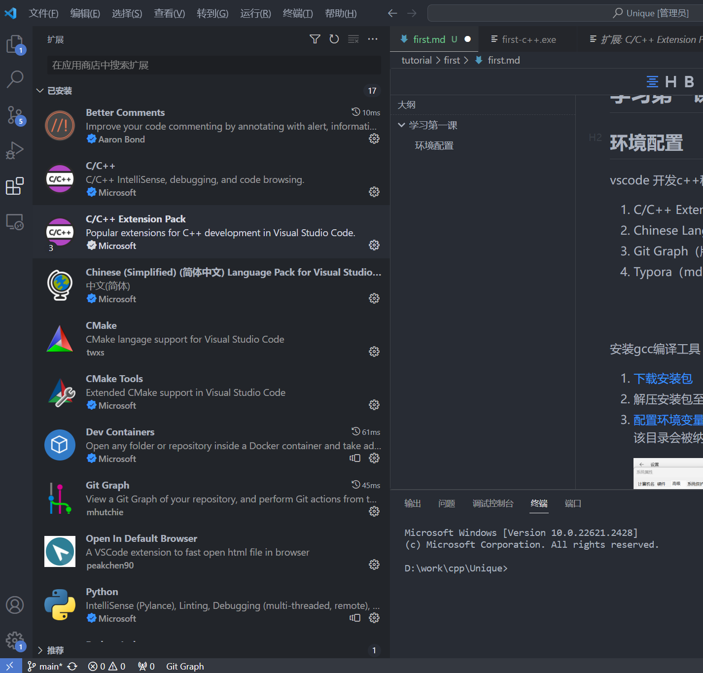
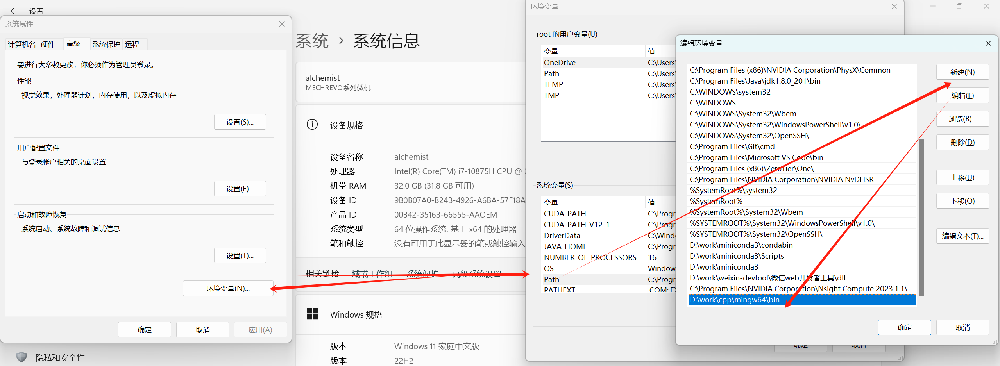
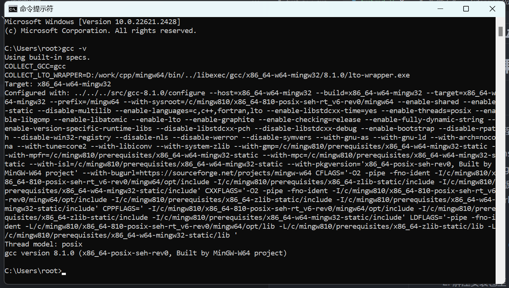
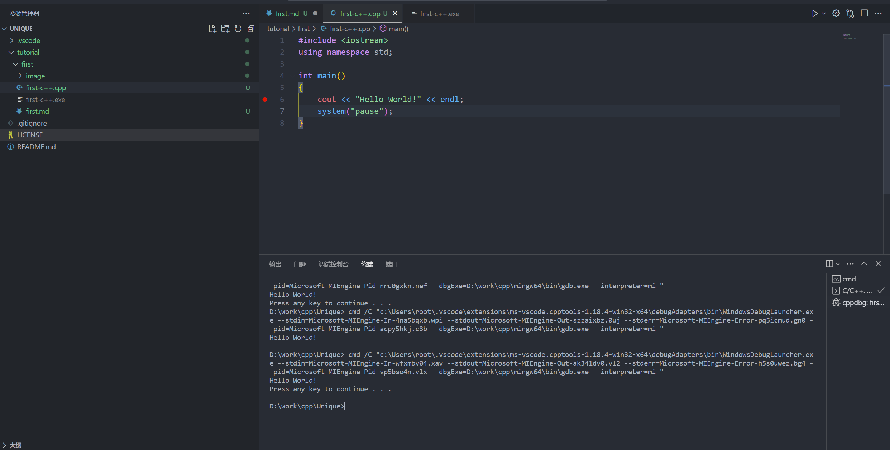

# 学习第一课

## 环境配置

vscode 开发c++程序，搜索并安装以下插件

1. C/C++ Extension Pack（C++程序开发插件包）
2. Chinese Language Pack （VScode中文界面）
3. Git Graph（版本控制工具Git体验提升，可视化查看提交记录，代码差异）
4. Typora（md文件的编辑工具，当前文档即为Markdown文本，Markdown文本、word、excel编写）

   

安装gcc编译工具（Windows）

1. [下载安装包](https://sourceforge.net/projects/mingw-w64/files/Toolchains%20targetting%20Win64/Personal%20Builds/mingw-builds/8.1.0/threads-posix/seh/x86_64-8.1.0-release-posix-seh-rt_v6-rev0.7z)
2. 解压安装包至（D:\work\cpp\mingw64）可自定义目录，后续随自定义内容替换即可
3. [配置环境变量](https://blog.csdn.net/wangpaiblog/article/details/113532591)，将 D:\work\cpp\mingw64\bin 配置为环境变量，配置环境变量后，在任意目录下执行命令时，该目录会被纳入检索，若该目录存在被执行的命令，可以直接执行，否则提示无法找到命令

   
4. cmd命令行运行 gcc -v， 提示gcc版本信息

编译运行第一个c++程序

1. 现在到当前目录下的first-c++.cpp文件， 点击右上角的运行，成功打印Hello World!

   
