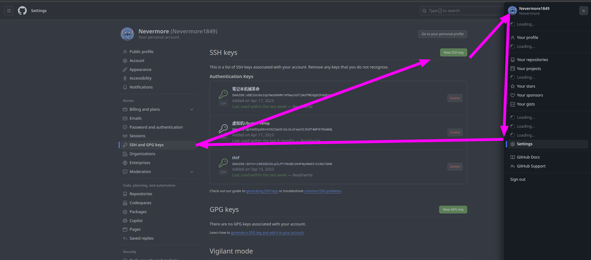
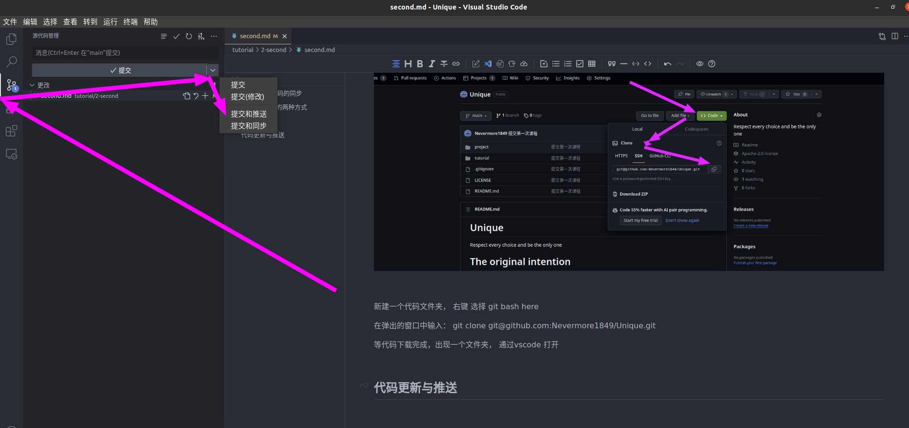
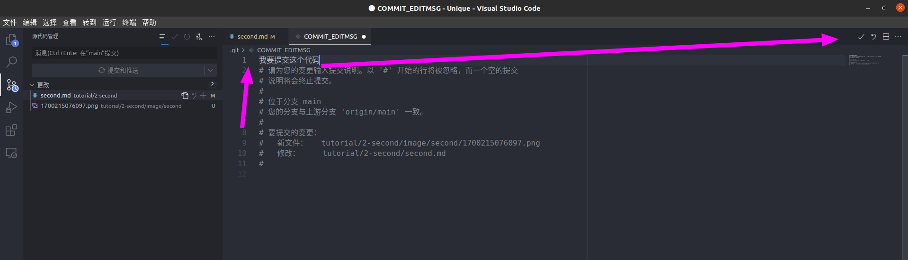

# 通过Git完成代码的同步

> 上一节内容，我们已经完成了通过vscode开发c++代码的环境配置， 这一节我们学习使用git来将编写的代码放到github库中

## git 下载代码的两种方式

1. HTTP链接

HTTP链接直接参考git克隆章节调用命令即可， 不过每次提交更新都需要输入账号密码，非常麻烦，一般不使用

2. SSH链接

SSH 链接需要ssh认证，ssh是远程访问服务器采用的协议，所以我们需要在我们的github账户中添加 RSA 公钥，以此来保证不需要每次更新代码都要输入账号密码

配置ssh账号密钥

1. 先在本地生成密钥对，私钥是锁，公钥是钥匙
2. 找到本地账户目录下的.ssh文件夹，以文本文档方式打开id_rsa.pub的公钥文件， 复制文件内容
3. 上传到github

[参考链接](https://www.jianshu.com/p/2790a860f151)

## git 克隆

使用场景：本地还没有同步过远程仓库， 需要从github中下载代码

首先，我们找到这个github项目：https://github.com/Nevermore1849/Unique

新建一个代码文件夹， 右键 选择 git bash here

在弹出的窗口中输入： git clone git@github.com:Nevermore1849/Unique.git

等代码下载完成，出现一个文件夹， 通过vscode 打开

## 代码更新与推送

本小节内容基于vscode环境及git graph插件

从远端仓库克隆代码到本地后， 之后需要不断保持本地和远端仓库代码同步，来协助多人同时开发

开发代码前，从远端仓库拉取（pull)代码， 同步远端后，编写代码或者更改文件

通过git add . 将所有修改的代码文件添加到暂存区，表示我要更新这部分代码了

通过git commit -m 将修改内容进行简要的描述提交代码修改

通过git push 将本地的改动合入远端仓库

在vscode中，有了插件的帮助， 我们就可以通过按照下图点击， 完成代码的同步

查看远端仓库github 代码提交成功
